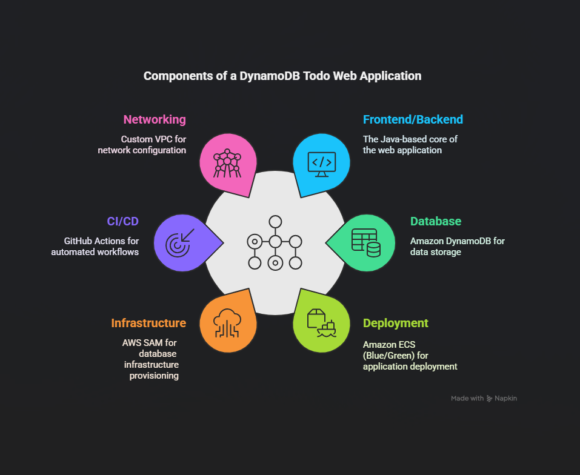

# DynamoDB Todo Web Application

A containerized Todo web application that uses Amazon DynamoDB as a datastore, deployed on Amazon ECS with automated CI/CD pipelines.

## Project Overview

This project implements a fully functional Todo application that allows users to create, read, update, and delete todo items. The application is containerized using Docker, stored in Amazon ECR, and deployed to Amazon ECS with blue/green deployment capabilities.

## Architecture

- **Frontend/Backend**: Java-based web application
- **Database**: Amazon DynamoDB
- **Deployment**: Amazon ECS (with optional ALB for multiple service tasks)
- **Infrastructure**: AWS SAM for DynamoDB provisioning
- **CI/CD**: GitHub Actions for automated build and deployment
- **Networking**: Custom VPC with public/private subnet options




## Features

- Create new todo items
- View a list of todo items
- Update existing todo items
- Delete todo items
- Responsive and intuitive UI

## Project Structure

```
dynamodb-app/
├── .aws-sam/               # AWS SAM build artifacts
├── .github/                # GitHub Actions workflow configurations
├── .idea/                  # IntelliJ IDEA configuration files
├── .mvn/                   # Maven wrapper files
├── src/
│   ├── main/
│   │   ├── java/
│   │   │   └── com.example.dynamodb-app/
│   │   │       ├── config/
│   │   │       │   ├── DynamoDBConfig.java          # DynamoDB configuration
│   │   │       │   └── LocalDateTimeConverter.java  # Date/time conversion utility
│   │   │       ├── controller/
│   │   │       │   └── TodoController.java          # REST API endpoints
│   │   │       ├── model/
│   │   │       │   └── Todo.java                    # Todo data model
│   │   │       ├── repository/
│   │   │       │   └── TodoRepository.java          # Data access layer
│   │   │       ├── service/
│   │   │       │   └── TodoService.java             # Business logic layer
│   │   │       └── DynamoDBAppApplication.java      # Main application class
│   │   ├── resources/          # Application resources and configuration
├── test/                   # Unit and integration tests
├── target/                 # Compiled output
├── .dockerignore           # Docker build exclusions
├── .gitattributes          # Git attributes configuration
├── .gitignore              # Git exclusions
├── appspec.yaml            # Application specification for deployment
├── Dockerfile              # Docker image definition
├── dynamoapp-ecsstack-deploy.yaml    # ECS stack deployment configuration
├── dynamoapp-ecstemplate.yaml        # ECS CloudFormation template
├── dynamoapp-stack-deploy.yaml       # Main stack deployment configuration
├── dynamoapp-template.yaml           # Main CloudFormation template
├── dynamoSam-stack-deploy.yaml       # DynamoDB SAM deployment
```

## Prerequisites

- AWS Account
- AWS CLI configured
- Java 21
- Maven
- Docker
- Git
- GitHub account

## Setup and Deployment

### 1. Clone the Repository

```bash
git clone <repository-url>
cd dynamodb-app
```

### 2. Deploy DynamoDB Infrastructure

The DynamoDB table is provisioned separately using AWS SAM:

```bash
sam deploy -t dynamoSAM-template.yaml --stack-name todo-dynamodb-stack
```

### 3. Local Development

Build and run the application locally:

```bash
mvn clean install
mvn spring-boot:run
```

Access the application at http://localhost:5000

### 4. Manual Deployment

Build and push Docker image to Amazon ECR:

```bash
aws ecr get-login-password --region <your-region> | docker login --username AWS --password-stdin <your-account>.dkr.ecr.<your-region>.amazonaws.com
docker build -t todo-app .
docker tag todo-app:latest <your-account>.dkr.ecr.<your-region>.amazonaws.com/todo-app:latest
docker push <your-account>.dkr.ecr.<your-region>.amazonaws.com/todo-app:latest
```

### 5. CI/CD Pipeline

The application uses GitHub Actions for CI/CD:

1. When code is pushed to the main branch, it triggers the build workflow
2. The application is built and a Docker image is created
3. The image is pushed to Amazon ECR
4. A separate deployment pipeline is triggered for blue/green deployment to ECS

## Infrastructure

### VPC Configuration

The application can be deployed in either:
- Public subnet with direct internet access
- Private subnet with NAT Gateway for outbound traffic and Application Load Balancer for inbound traffic

### DynamoDB

- Provisioned using AWS SAM template
- Configured with on-demand capacity to scale automatically
- Stores todo items with unique identifiers

### ECS Deployment

- ECS Tasks running the containerized application
- Optional ALB for multiple service tasks
- Blue/Green deployment strategy for zero-downtime updates

## API Endpoints

| HTTP Method | Endpoint | Description |
|-------------|----------|-------------|
| GET | /api/todos | Get all todo items |
| GET | /api/todos/{id} | Get a specific todo item |
| POST | /api/todos | Create a new todo item |
| PUT | /api/todos/{id} | Update a todo item |
| DELETE | /api/todos/{id} | Delete a todo item |

## Environment Variables

The application requires the following environment variables:

| Name | Description | Default |
|------|-------------|---------|
| AWS_REGION | AWS Region for DynamoDB | us-east-1 |
| DYNAMODB_ENDPOINT | Optional local DynamoDB endpoint | None |
| DYNAMODB_TABLE_NAME | Name of the DynamoDB table | TodoItems |

## Contributing

1. Fork the repository
2. Create a feature branch (`git checkout -b feature/amazing-feature`)
3. Commit your changes (`git commit -m 'Add some amazing feature'`)
4. Push to the branch (`git push origin feature/amazing-feature`)
5. Open a Pull Request

## License

This project is licensed under the MIT License - see the LICENSE file for details.

## Acknowledgements

- AWS Documentation
- Spring Boot Framework
- AWS SDK for Java